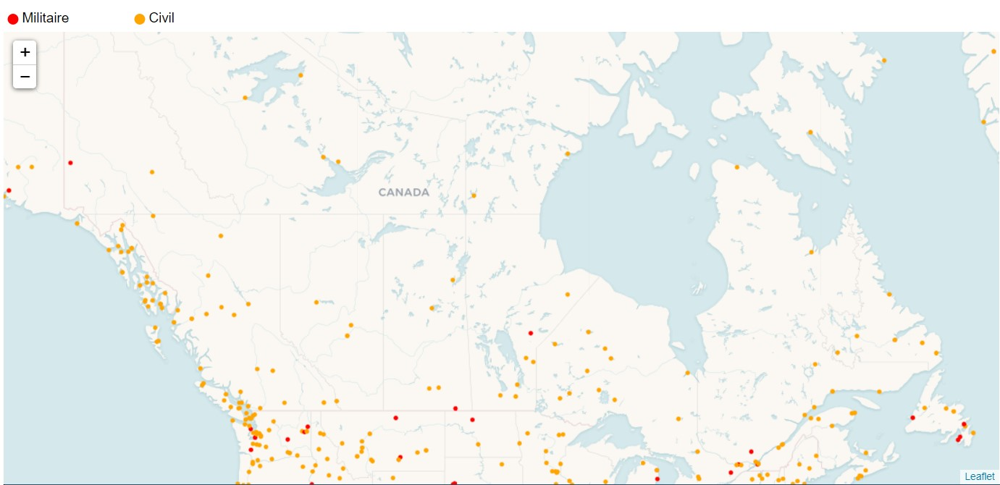
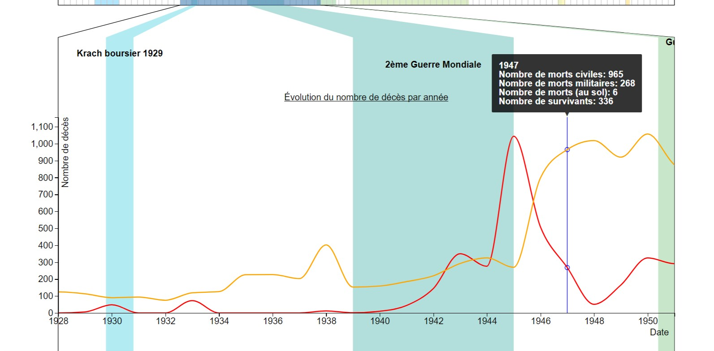
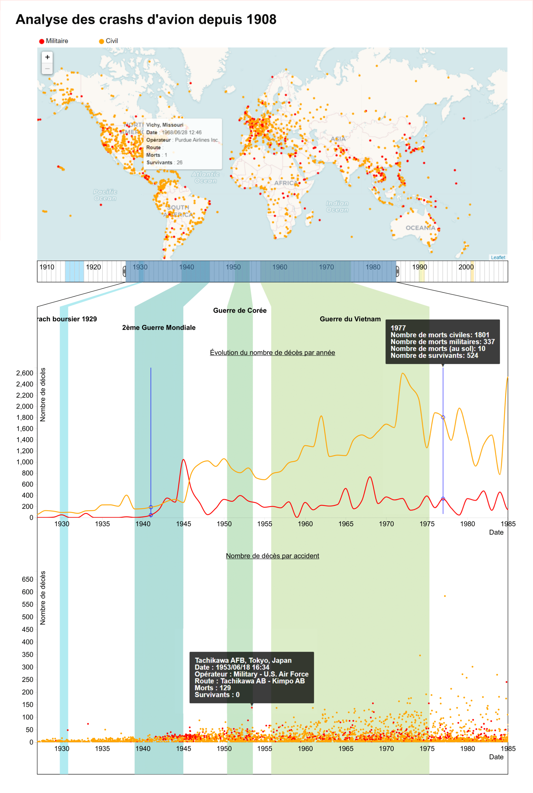

# Analyse des écrasements d'avions depuis 1908

## Projet final du cours INF8808

### Mise en contexte

Ce projet à été réalisé en [d3.js](https://d3js.org/) comme projet final pour le cours *Visualisation de données* (INF8808) pendant la session d'hiver 2020 à Polytechnique Montréal.

Une version interactive du résultat final est disponible ici:  https://michr97.github.io/INF8808_Equipe2/

### But

Nous avons choisi d'analyser l'histoire des écrasements d'avion à travers différentes visualisations. Notre jeu de données comprend plus de 4000 évènements répartis sur une centaine d'années. Notre projet permet d'analyser les différentes tendances sur le plan géographique et quantitatif.

## Les visualisations

Nous avons 3 éléments principaux à notre visualisation.

### Le slider

Celui-ci permet de sélectionner une plage de date. Cette plage de date est en fait un filtre qui s'applique sur toutes les autres sections. Seuls les écrasements inclus entre les bornes sont affichés.

### La carte

La carte permet de voir l'emplacement exact de chaque écrasement. Les écrasements sont représentés par un point. Lorsque la souris passe par dessus un point, de l'information supplémentaire est affichée.

### La ligne du temps

La ligne du temps permet de voir les possibles corrélations entre le nombre d'écrasements et différents évènements ou certaines périodes historiques.

## Sources des données

https://data.world/data-society/airplane-crashes

## Contributeurs

 * Hugo Tremblay
 * Gabriel Cyr-St-Georges
 * Kevin Pastor
 * Elias Jambari
 * Michaël Chrétien

 ## Version statique

 

